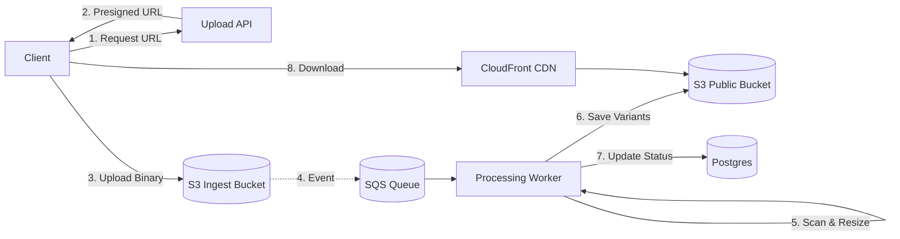

# High-Level Design

## The "Presigned URL" Pattern

We do **not** stream file bytes through our Node.js API. Node.js is single-threaded; blocking the event loop with 50MB buffers is suicide.

### Architecture Components

1.  **Upload API**: Generates Presigned URLs. Authentication & Quota check.
2.  **Object Storage (S3)**: The landing zone.
3.  **Event Bus (SQS/EventBridge)**: Triggered when S3 object creates.
4.  **Media Workers (Lambda/Fargate)**: Process the file.
5.  **CDN (CloudFront)**: Caches the final public assets.

## Request Flow

1.  **Client** requests Upload URL: `POST /upload/sign { type: 'image/jpeg' }`.
2.  **Upload API** returns: `https://s3.aws.com/bucket/key?signature=...`.
3.  **Client** PUTs file binary directly to **S3**.
4.  **S3** triggers `ObjectCreated` event → **SQS Queue**.
5.  **Worker** pulls job:
    - Downloads file.
    - Scans for viruses.
    - Resizes.
    - Uploads processed variants to `public-bucket`.
    - Updates `media` table in Postgres (`status: 'READY'`).

## Diagram

