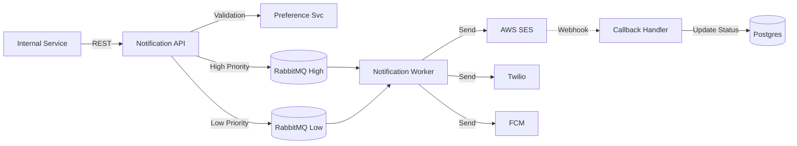

# High-Level Design

## Architecture

The system acts as a **Router** and **Queuing Engine** between Internal Services and External Providers.

### Components

1.  **Notification API**: Receives send requests. Validates inputs.
2.  **Priority Queue (RabbitMQ)**: Routes messages based on urgency.
3.  **Workers**: Stateless consumers that format messages and call 3rd party APIs.
4.  **Preference Service**: Checks if User X allows Channel Y.
5.  **Status Callback Handler**: Webhook receiver for SendGrid/Twilio updates.

## Request Flow

1.  **Order Service** requests: `POST /send { type: "ORDER_CONFIRMED", userId: "123" }`.
2.  **Notification API**:
    - Validates payload.
    - Checks **Preference Cache** (Redis) to see if user 123 is unsubscribed.
    - Publishes job to `notifications.high_priority` queue.
3.  **Worker**:
    - Pulls job.
    - Fetches "Order Confirmed" template from DB/Cache.
    - Hydrates template with data.
    - Calls AWS SES (Email) API.
    - Stores `notification_log` with status `PENDING`.

## Diagram

