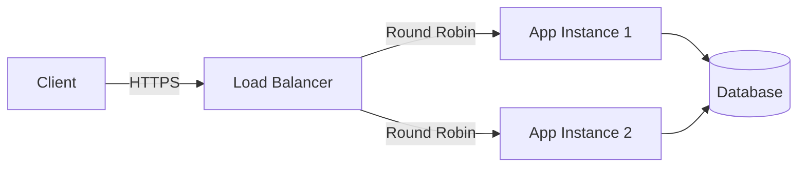

# System Architecture Diagrams

This repository uses **Mermaid.js** for diagramming. This allows diagrams to be version-controlled, searchable, and easily editable as code.

## Why Code-as-Diagrams?

- **Git Diffable**: You can see exactly what changed in the architecture.
- **Consistency**: No mismatched fonts or ugly manually aligned boxes.
- **Maintenance**: To update a diagram, you edit text, not export a PNG from a proprietary tool.

## Tools

- **Editor**: VS Code with `Markdown Preview Mermaid Support` extension.
- **Web**: [Mermaid Live Editor](https://mermaid.live).

## Diagram Types Used

1.  **Flowcharts** (`graph TD`): For high-level architecture and component relationships.
2.  **Sequence Diagrams** (`sequenceDiagram`): For step-by-step request flows (e.g., Auth Flow).
3.  **Entity Relationship Diagrams** (`erDiagram`): For Database Schemas.

## Example

A simple Load Balancer flow:

