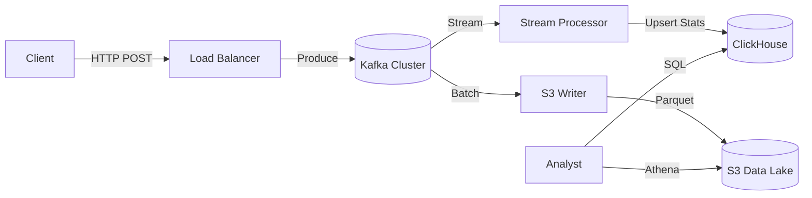

# Analytics Event Pipeline Architecture

```mermaid
graph LR
    Client -->|HTTP POST| LB[Load Balancer]
    LB -->|Produce| Kafka[(Kafka Cluster)]
    
    Kafka -->|Stream| Flink[Stream Processor]
    Kafka -->|Batch| S3Loader[S3 Writer]
    
    Flink -->|Upsert Stats| OLAP[(ClickHouse)]
    S3Loader -->|Parquet| S3[(S3 Data Lake)]
    
    User[Analyst] -->|SQL| OLAP
    User -->|Athena| S3
```
