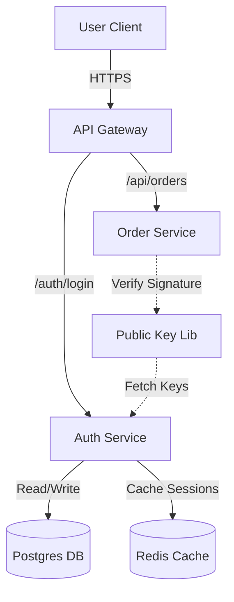

# Authentication System Architecture

```mermaid
graph TD
    User[User Client] -->|HTTPS| Gateway[API Gateway]
    Gateway -->|/auth/login| AuthSvc[Auth Service]
    Gateway -->|/api/orders| OrderSvc[Order Service]
    
    AuthSvc -->|Read/Write| DB[(Postgres DB)]
    AuthSvc -->|Cache Sessions| Redis[(Redis Cache)]
    
    OrderSvc -.->|Verify Signature| AuthLib[Public Key Lib]
    AuthLib -.->|Fetch Keys| AuthSvc
```
