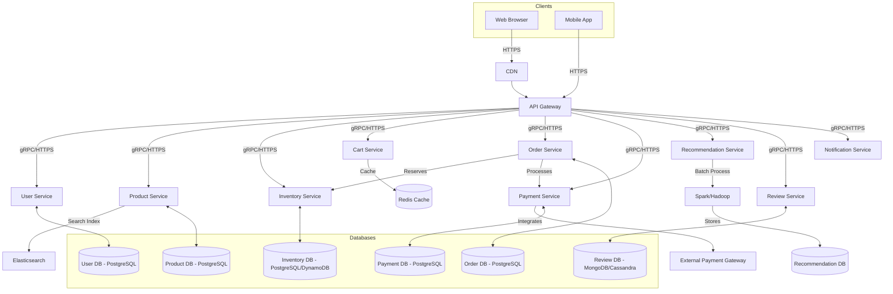

# E-commerce Platform Architecture

```mermaid
graph TD
    subgraph Clients
        Web[Web Browser]
        Mobile[Mobile App]
    end

    Web -- HTTPS --> CDN[CDN]
    Mobile -- HTTPS --> API_GW[API Gateway]
    CDN --> API_GW

    API_GW -- gRPC/HTTPS --> UserSvc[User Service]
    API_GW -- gRPC/HTTPS --> ProductSvc[Product Service]
    API_GW -- gRPC/HTTPS --> InventorySvc[Inventory Service]
    API_GW -- gRPC/HTTPS --> CartSvc[Cart Service]
    API_GW -- gRPC/HTTPS --> OrderSvc[Order Service]
    API_GW -- gRPC/HTTPS --> PaymentSvc[Payment Service]
    API_GW -- gRPC/HTTPS --> RecomSvc[Recommendation Service]
    API_GW -- gRPC/HTTPS --> ReviewSvc[Review Service]
    API_GW -- gRPC/HTTPS --> NotifSvc[Notification Service]

    ProductSvc -- Search Index --> Elastic[Elasticsearch]
    CartSvc -- Cache --> Redis[(Redis Cache)]

    OrderSvc -- Reserves --> InventorySvc
    OrderSvc -- Processes --> PaymentSvc

    PaymentSvc -- Integrates --> PaymentGateway[External Payment Gateway]

    RecomSvc -- Batch Process --> Spark[Spark/Hadoop]
    Spark -- Stores --> RecomDB[(Recommendation DB)]

    subgraph Databases
        UserDB[(User DB - PostgreSQL)]
        ProductDB[(Product DB - PostgreSQL)]
        InventoryDB[(Inventory DB - PostgreSQL/DynamoDB)]
        OrderDB[(Order DB - PostgreSQL)]
        PaymentDB[(Payment DB - PostgreSQL)]
        ReviewDB[(Review DB - MongoDB/Cassandra)]
    end

    UserSvc <--> UserDB
    ProductSvc <--> ProductDB
    InventorySvc <--> InventoryDB
    OrderSvc <--> OrderDB
    PaymentSvc <--> PaymentDB
    ReviewSvc <--> ReviewDB
```
