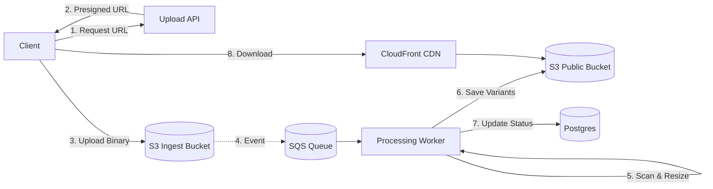

# File Upload Service Architecture

```mermaid
graph LR
    User[Client] -->|1. Request URL| API[Upload API]
    API -->|2. Presigned URL| User
    User -->|3. Upload Binary| S3_Ingest[(S3 Ingest Bucket)]
    
    S3_Ingest -.->|4. Event| SQS[(SQS Queue)]
    SQS --> Worker[Processing Worker]
    
    Worker -->|5. Scan & Resize| Worker
    Worker -->|6. Save Variants| S3_Public[(S3 Public Bucket)]
    Worker -->|7. Update Status| DB[(Postgres)]
    
    User -->|8. Download| CDN[CloudFront CDN]
    CDN --> S3_Public
```
