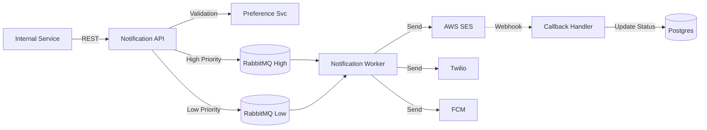

# Notification System Architecture

```mermaid
graph LR
    Client[Internal Service] -->|REST| API[Notification API]
    API -->|Validation| Prefs[Preference Svc]
    
    API -->|High Priority| Q1[(RabbitMQ High)]
    API -->|Low Priority| Q2[(RabbitMQ Low)]
    
    Q1 --> Worker[Notification Worker]
    Q2 --> Worker
    
    Worker -->|Send| Ext1[AWS SES]
    Worker -->|Send| Ext2[Twilio]
    Worker -->|Send| Ext3[FCM]
    
    Ext1 -.->|Webhook| Callback[Callback Handler]
    Callback -->|Update Status| DB[(Postgres)]
```
