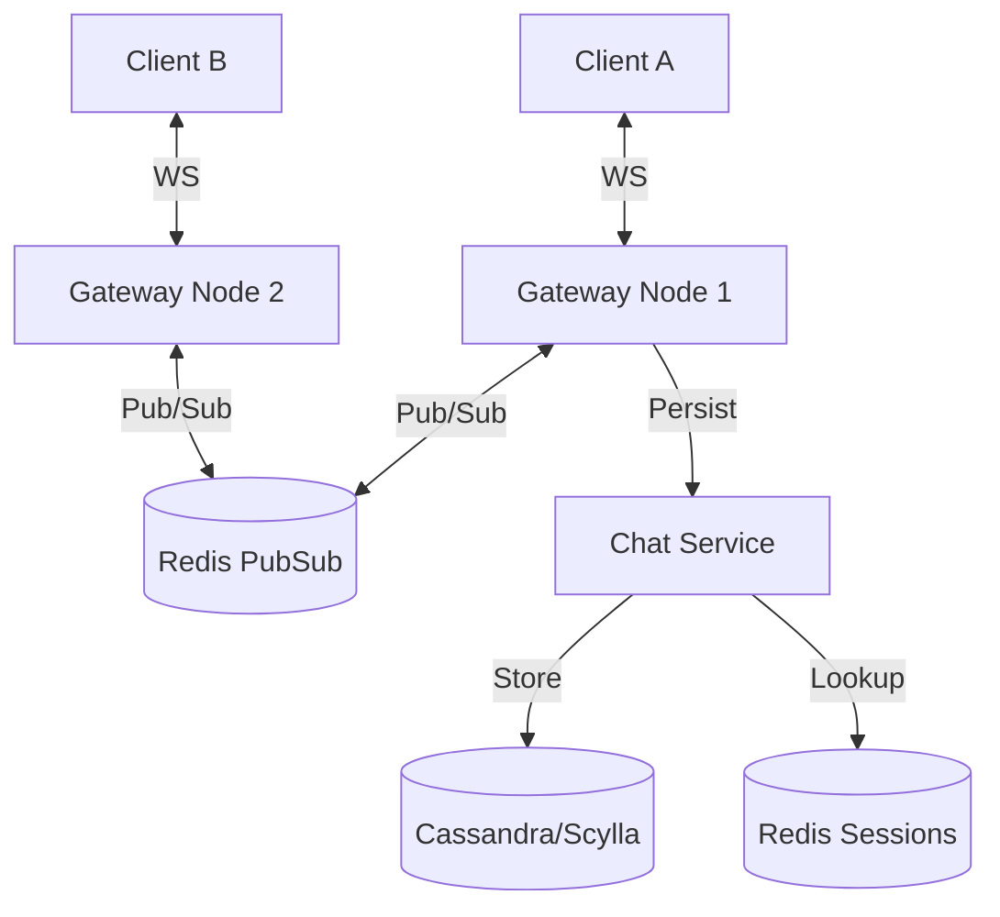

# Real-Time Chat System Architecture

```mermaid
graph TD
    UserA[Client A] <-->|WS| GW1[Gateway Node 1]
    UserB[Client B] <-->|WS| GW2[Gateway Node 2]
    
    GW1 <-->|Pub/Sub| Redis[(Redis PubSub)]
    GW2 <-->|Pub/Sub| Redis
    
    GW1 -->|Persist| ChatSvc[Chat Service]
    ChatSvc -->|Store| DB[(Cassandra/Scylla)]
    
    ChatSvc -->|Lookup| SessionCache[(Redis Sessions)]
```
