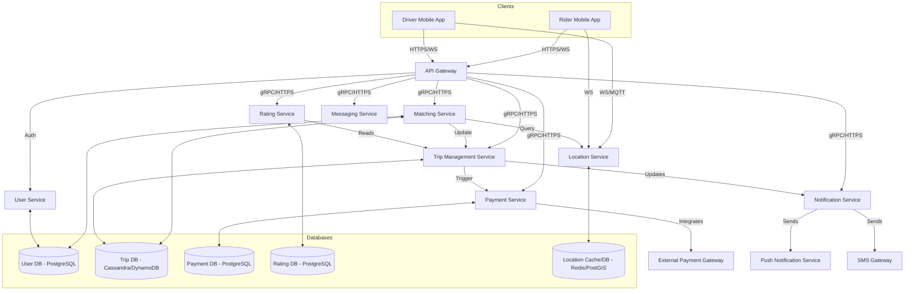

# Ride-Sharing App Architecture

```mermaid
graph TD
    subgraph Clients
        RiderApp[Rider Mobile App]
        DriverApp[Driver Mobile App]
    end

    RiderApp -- HTTPS/WS --> API_GW[API Gateway]
    DriverApp -- HTTPS/WS --> API_GW

    API_GW -- gRPC/HTTPS --> MatchingSvc[Matching Service]
    API_GW -- gRPC/HTTPS --> TripSvc[Trip Management Service]
    API_GW -- gRPC/HTTPS --> PaymentSvc[Payment Service]
    API_GW -- gRPC/HTTPS --> NotifSvc[Notification Service]
    API_GW -- gRPC/HTTPS --> RatingSvc[Rating Service]
    API_GW -- gRPC/HTTPS --> MessagingSvc[Messaging Service]

    DriverApp -- WS/MQTT --> LocSvc[Location Service]
    RiderApp -- WS --> LocSvc

    MatchingSvc -- Query --> LocSvc
    MatchingSvc -- Update --> TripSvc

    TripSvc -- Updates --> NotifSvc
    TripSvc -- Trigger --> PaymentSvc

    PaymentSvc -- Integrates --> PaymentGateway[External Payment Gateway]

    RatingSvc -- Reads --> TripSvc

    NotifSvc -- Sends --> PushNotifSvc[Push Notification Service]
    NotifSvc -- Sends --> SMSGateway[SMS Gateway]

    subgraph Databases
        UserDB[(User DB - PostgreSQL)]
        TripDB[(Trip DB - Cassandra/DynamoDB)]
        PaymentDB[(Payment DB - PostgreSQL)]
        RatingDB[(Rating DB - PostgreSQL)]
        LocationDB[(Location Cache/DB - Redis/PostGIS)]
    end

    MatchingSvc <--> UserDB
    MatchingSvc <--> TripDB
    TripSvc <--> TripDB
    PaymentSvc <--> PaymentDB
    RatingSvc <--> RatingDB
    LocSvc <--> LocationDB
    UserSvc[User Service] <--> UserDB
    API_GW -- Auth --> UserSvc
```
