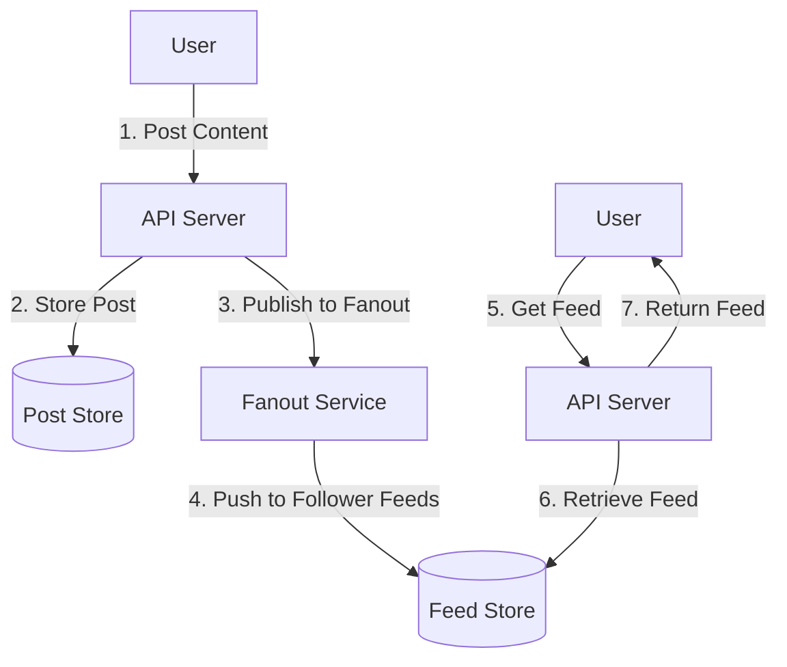

# Social Media Feed Architecture

```mermaid
graph TD
    User[User] -- "1. Post Content" --> API[API Server]
    API -- "2. Store Post" --> PostStore[(Post Store)]
    API -- "3. Publish to Fanout" --> Fanout[Fanout Service]
    Fanout -- "4. Push to Follower Feeds" --> FeedStore[(Feed Store)]

    User2[User] -- "5. Get Feed" --> API2[API Server]
    API2 -- "6. Retrieve Feed" --> FeedStore
    API2 -- "7. Return Feed" --> User2
```
