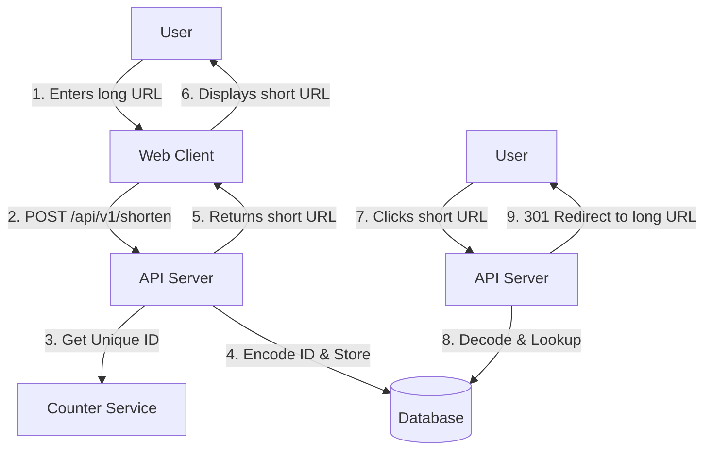

# URL Shortener Architecture

```mermaid
graph TD
    User[User] -- "1. Enters long URL" --> Web[Web Client]
    Web -- "2. POST /api/v1/shorten" --> API[API Server]
    API -- "3. Get Unique ID" --> Counter[Counter Service]
    API -- "4. Encode ID & Store" --> DB[(Database)]
    API -- "5. Returns short URL" --> Web
    Web -- "6. Displays short URL" --> User

    User2[User] -- "7. Clicks short URL" --> API2[API Server]
    API2 -- "8. Decode & Lookup" --> DB
    API2 -- "9. 301 Redirect to long URL" --> User2
```
